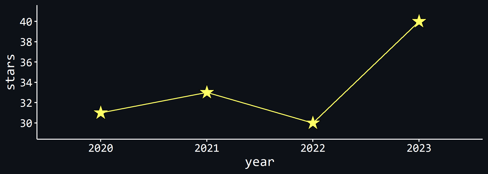

# Advent of Code 2023

This repo contains my solutions for the [Advent of
Code](https://adventofcode.com/) 2023 in `R`.

Here’s my past performance:

However, this year is not really about performance, especially not when
it comes to completion times. Most of the code in this repo was written
using only one hand, because I’m nursing a three-month old baby with the
other.

Follow me on [Bluesky](https://bsky.app/profile/juli-nagel.bsky.social),
where I will post about my solutions as well!

## TOC

Here is a table of contents showing you what each day was about, along
with some stats. Completion time refers to the time it took me to
complete the puzzle since release (part 1, and part 2 in brackets), as
tracked on the Advent of Code website. Next is my rank for the puzzle on
that day (part 1 (part 2)), and finally the runtime of my code. It’s a
crude measure of runtime[^1], where I simply calculate the difference in
`Sys.time()` at the beginning and the end of part 1, and the beginning
and end of part 2. That means in some occasions, the runtime for part 2
will be much shorter because part of the code needed to solve part 2 was
already run in part 1. Reading in the data (and sometimes, basic
preprocessing that has nothing to do with the puzzle solution) is
excluded from the run time calculations.

| Day | Title          | Completion Time     | Rank          | Run Time        |
|-----|----------------|---------------------|---------------|-----------------|
| 1   | Trebuchet?!    | 02:15:03 (03:50:15) | 20750 (18843) | 7.92 (83.07) ms |
| 2   | Cube Conundrum | 05:21:47 (05:27:15) | 34591 (32070) | 85.35 (9.00) ms |

[^1]: I know these stats are basically meaningless for anyone else’s
    computer, but to put things into perspective, here are my computer
    stats: Razer Blade 15 Base Model, Intel Core i7-10750H CPU @
    2.60GHz, 259 Mhz, 6 Cores, 12 Logical Processors, 16 GB RAM
